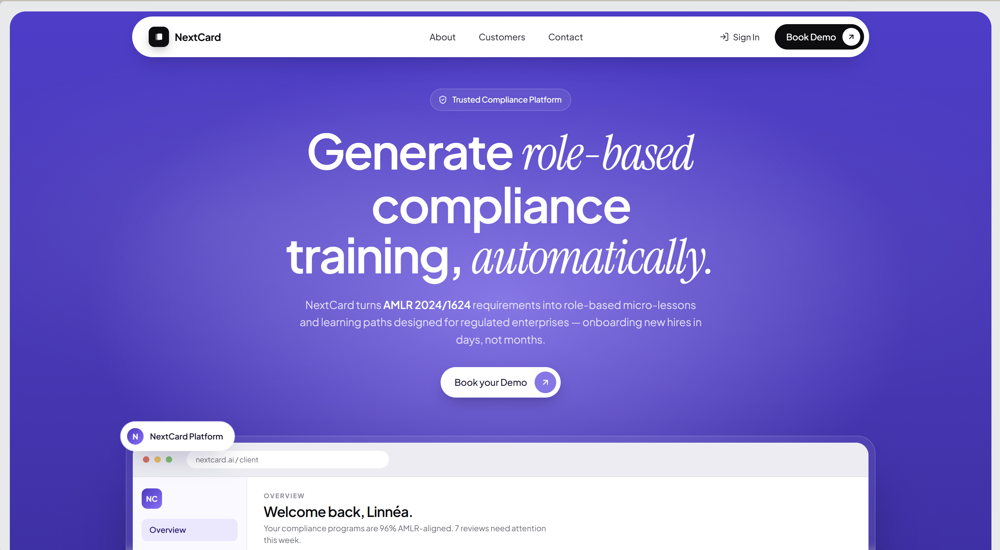

<div align="center">

<br />

# 🛡️ NextCard

### _Role-based AMLR compliance training, generated automatically_

<br />


<br />

> A B2B compliance training platform that turns **AMLR Regulation (EU) 2024/1624**
> into role-based, risk-aware learning paths for banks, fintech, and real-estate firms —
> built with Next.js, TypeScript, Tailwind, Supabase, and the Anthropic & OpenAI SDKs.

<br />

🌐 **Live demo →** [next-card-eta.vercel.app](https://next-card-eta.vercel.app/)

<br />

🏆 _Built for the **Stockholm Hackathon 2026** — turning EU AML regulation into a product in 48 hours._

<br />



<br />

</div>

---

## ✨ Features

- **🧭 Role-based program builder** — 4 AMLR roles (AML Officer, KYC Analyst, Branch Manager, Customer Onboarding) with risk-aware article mapping
- **📚 Course Builder with explainability** — automatic risk → AMLR article mapping with "why this article is needed" reasoning
- **🎓 Learner portal** — per-employee training paths sourced from the builder plan, with completion tracking
- **🏢 Client workspace** — dashboard for employees, courses, documents, audit, and reports
- **👥 Team dashboard** — manage clients, demo requests, course requests, and inbox in one place
- **🔐 Dual sign-in modes** — separate authentication flows for client admins and individual learners
- **🌍 B2B landing site** — hero with live preview, who-we-are, who-we-work-with, and contact sections
- **📱 Responsive UI** — Plus Jakarta Sans + Instrument Serif typography, neutral pill-light palette with navy & gold accents

---

## 🧰 Tools & Tech Stack

| Layer            | Tools                                                                |
| ---------------- | -------------------------------------------------------------------- |
| **Framework**    | Next.js 14 (App Router), React 18, TypeScript 5                      |
| **Styling**      | Tailwind CSS 3, CSS Modules, `tailwindcss-animate`, `tailwind-merge` |
| **UI & Icons**   | Lucide React, `class-variance-authority`, `clsx`, `flag-icons`       |
| **Auth & DB**    | Supabase (`@supabase/ssr`, `@supabase/supabase-js`)                  |
| **AI / LLM**     | Anthropic SDK, OpenAI SDK                                            |
| **Parsing**      | `node-html-parser` for ingesting source documents                    |
| **Tooling**      | ESLint, PostCSS, Autoprefixer                                        |
| **Deployment**   | Vercel                                                               |
| **Design**       | Figma, Canva                                                         |
| **Dev workflow** | GitHub, VS Code                                                      |

---

## 📁 Project Structure

```
NextCard/
├── app/                          # Next.js App Router
│   ├── page.tsx                  # B2B landing page
│   ├── client/                   # Client workspace
│   │   ├── employees/            # AMLR role profiles + details
│   │   ├── courses/              # Subtitle card + AMLR chips
│   │   ├── documents/            # Source document library
│   │   ├── audit/                # Compliance audit trail
│   │   ├── reports/              # Coverage & completion reports
│   │   └── settings/             # Workspace settings
│   ├── dashboard/                # Internal team dashboard
│   │   ├── clients/              # Client list + detail
│   │   ├── courses/              # Course Builder (risk → AMLR)
│   │   ├── inbox/                # Demo + course requests
│   │   └── demo/[id]/            # Demo request detail
│   └── learner/                  # Individual learner portal
│       └── courses/              # Per-learner training paths
├── components/
│   ├── hero-section/             # Landing hero with live preview
│   ├── who-we-are/               # Team & mission
│   ├── who-we-work-with/         # Target verticals
│   ├── contact-us/               # Contact form section
│   ├── navigation/               # Sticky nav
│   ├── footer/                   # Site footer
│   ├── signin-modal/             # Dual-mode sign-in (client / learner)
│   ├── dashboard-courses/        # Course Builder + explainability
│   ├── client-employees/         # Employee table + details modal
│   ├── learner-portal/           # Learner gate + overview
│   └── ui/                       # BrandMark, BookDemoButton, Container…
├── public/
│   └── team/                     # Team photos + preview
└── tailwind.config.ts            # Design tokens & theme
```

---

## 🚀 Getting Started

**1. Clone the repository**

```bash
git clone https://github.com/<your-org>/NextCard.git
cd NextCard
```

**2. Install dependencies**

```bash
npm install
```

**3. Configure environment variables**

Create a `.env.local` file in the project root:

```env
NEXT_PUBLIC_SUPABASE_URL=your-supabase-url
NEXT_PUBLIC_SUPABASE_ANON_KEY=your-supabase-anon-key
ANTHROPIC_API_KEY=your-anthropic-key
OPENAI_API_KEY=your-openai-key
```

**4. Run the dev server**

```bash
npm run dev
```

Open **http://localhost:3000**

---

## 📦 Deployment

NextCard is deployed on **Vercel** with zero-config Next.js support:

1. Push the repo to GitHub
2. Import the project at [vercel.com](https://vercel.com)
3. Add the environment variables from `.env.local` to the Vercel project settings
4. Vercel handles build, preview deployments, and production rollout automatically

🌐 Production: **[next-card-eta.vercel.app](https://next-card-eta.vercel.app/)**

---

## 🎨 Design System

| Token              | Value     | Usage                            |
| ------------------ | --------- | -------------------------------- |
| `--bg`             | `#E5E9EB` | Pill-light page background       |
| `--ink`            | `#1F2937` | Headings, primary text, navy CTA |
| `--accent`         | `#C9A961` | Gold accents & highlight chips   |
| `--muted`          | `#6B7280` | Secondary text                   |
| `--surface`        | `#FFFFFF` | Cards, modals, panels            |
| **Typography (a)** | Plus Jakarta Sans — global body & headings   |
| **Typography (b)** | Instrument Serif — italic accents in the hero |

---

## 🇸🇪 The Stockholm Hackathon

NextCard was built end-to-end during the **Stockholm Hackathon 2026** — from the
first sketch on a whiteboard to a deployed product in under 48 hours. The team
shipped the AMLR mapping engine, the Course Builder, the learner portal, and the
B2B landing page in a single weekend, powered by Next.js, Supabase, and modern LLM APIs.

---

<div align="center">

<br />

Made with care for regulated industries 🛡️

</div>
